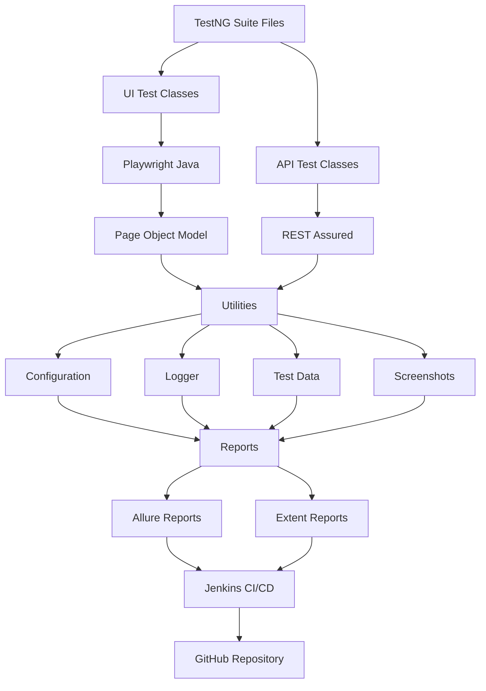

---

# 🏗 Framework Architecture

The framework follows a layered architecture to ensure scalability, maintainability, and reusability. It separates UI automation, API automation, utilities, reporting, and CI/CD into independent components.

## 📖 Architecture Layers

### 1️⃣ Test Execution Layer

- TestNG Suite XML files control test execution.
- UI and API suites can run independently.
- Supports parallel execution.

### 2️⃣ UI Automation Layer

- Developed using **Playwright Java**.
- Uses the **Page Object Model (POM)**.
- Keeps page locators and actions separate from test logic.

### 3️⃣ API Automation Layer

- Developed using **REST Assured**.
- Supports complete CRUD operations.
- Validates status codes, headers, cookies, and response bodies.

### 4️⃣ Utility Layer

Reusable utilities include:

- Configuration Reader
- Logger
- Screenshot Utility
- Wait Utility
- File Utility
- Data Provider
- Common Helpers

### 5️⃣ Reporting Layer

After execution, the framework automatically generates:

- TestNG Reports
- Allure Reports
- Extent Reports

### 6️⃣ CI/CD Layer

The framework integrates with:

- GitHub
- Jenkins
- Maven

for automated build and test execution.

---